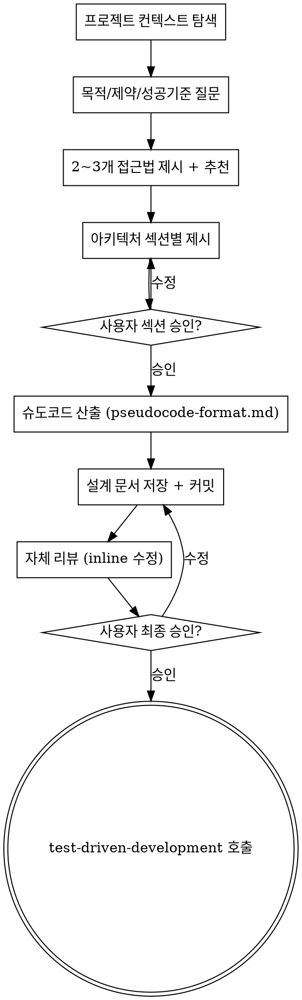

# Designing: Idea → Architecture → TDD-Ready Pseudocode

아이디어를 대화를 통해 **완전히 형성된 설계와 슈도코드**로 변환합니다. 슈도코드는
곧바로 TDD 사이클의 입력이 됩니다. 이 스킬의 terminal state는 `test-driven-development`
스킬을 호출하는 것입니다. 다른 어떤 스킬도 호출하지 않습니다.

<HARD-GATE>
Do NOT invoke test-driven-development, write any code, scaffold any project, or
take any implementation action until you have:
  (1) presented a design and received user approval for each section,
  (2) produced TDD-ready pseudocode following the format at pseudocode-format.md,
  (3) saved the design document and received user approval on it.

This applies to EVERY project regardless of perceived simplicity.
</HARD-GATE>

## Anti-Pattern: "이건 너무 단순해서 설계가 필요 없어"

모든 프로젝트는 이 절차를 거칩니다. todo 리스트 하나, 한 함수짜리 유틸리티, 설정
변경 — 전부 포함. "단순한" 프로젝트일수록 **검토되지 않은 가정**이 낭비로 이어집니다.
단순한 경우엔 설계가 몇 문장이면 충분하지만, 반드시 **제시하고 승인받아야** 합니다.

## Checklist

You MUST create a visible plan/checklist item for each of these and complete them in order:

1. **프로젝트 컨텍스트 탐색** — 관련 파일, 문서, 최근 커밋 확인
2. **목적·제약·성공기준 파악** — 한 번에 한 질문, 객관식 우선
3. **2~3개 접근법 제시** — 트레이드오프 포함, 추천안 먼저
4. **아키텍처를 섹션별로 제시** — 섹션마다 사용자 승인 받기
5. **TDD-ready 슈도코드 산출** — pseudocode-format.md 규격 따름
6. **설계 문서 저장** — `docs/design/YYYY-MM-DD-<주제>.md` + 커밋
7. **자체 리뷰** — placeholder / 모순 / 스코프 / 모호함 검사
8. **사용자 최종 검토 게이트** — 저장된 문서를 사용자가 검토하도록 요청
9. **인계** — `test-driven-development` 스킬 호출

## Process Flow



**Terminal state는 `test-driven-development` 호출입니다.** 그 외 어떤 구현 스킬도
호출하면 안 됩니다.

## 상세형 대화 규칙

### 질문 방식
- **한 번에 하나의 질문.** 여러 주제가 필요하면 여러 턴으로 쪼갭니다.
- **객관식 선호.** 선택지 2~4개가 자연스러울 때는 객관식으로. 자유 답변은 꼭 필요할 때만.
- 질문 **순서**: 목적(왜) → 제약(무엇이 막는가) → 성공기준(뭐가 되면 끝인가).

### 스코프 점검 (질문 전 먼저)
요청이 여러 독립 서브시스템을 묶고 있다면 (예: "채팅·파일저장·결제·분석을 다 갖춘
플랫폼") **즉시 지적**합니다. 잘못 쪼개진 프로젝트의 세부사항을 다듬느라 질문을
소모하지 않습니다. 각 서브시스템은 **자체 스펙 → 자체 계획 → 자체 구현** 사이클을
가집니다. 분해를 돕고, 그다음 **첫 번째 서브시스템**만 일반 설계 흐름으로 들어갑니다.

### 접근법 제시
- **추천안을 먼저 말하고 이유를 설명**, 그다음에 대안 1~2개.
- 트레이드오프는 구체적으로: "(a)는 10분, 기능 X 못함. (b)는 반나절, 기능 X 가능."
- 사용자가 납득하지 못하면 되돌아가 더 질문하거나 새 대안을 제시합니다.

### 아키텍처 섹션 제시
- 섹션마다 **최대 200~300 단어**. 간단한 시스템은 몇 문장이면 됨.
- 한 섹션 끝날 때마다 **"여기까지 괜찮나요?"** 명시적으로 묻기.
- 다룰 것들 (해당되는 것만): 구성요소, 데이터 흐름, 에러 처리, 경계/인터페이스, 테스트 전략.
- 사용자가 "이상하다"고 하면 **즉시 되돌아가** 질문을 더 합니다. 밀고 나가지 마세요.

### 단위 분리와 명확성을 위한 설계
- 시스템을 **하나의 명확한 목적**을 갖는 작은 단위로 쪼갭니다.
- 각 단위는 잘 정의된 인터페이스로 통신하며, 독립적으로 이해/테스트 가능해야 합니다.
- 각 단위에 대해 답할 수 있어야 함: **무엇을 하는가, 어떻게 쓰는가, 무엇에 의존하는가**.
- 내부를 읽지 않아도 동작을 이해할 수 있어야 하고, 내부를 바꿔도 소비자를 깨면 안 됩니다.
- 파일이 커진다는 것은 보통 "너무 많은 일을 하고 있다"는 신호입니다.

### 기존 코드베이스에서 작업할 때
- 제안하기 전에 **현재 구조를 탐색**합니다. 기존 패턴을 따릅니다.
- 작업 중인 코드에 문제가 있다면 (너무 큰 파일, 뒤엉킨 책임) **목표와 관련된 범위**
  에서 개선을 포함합니다. 좋은 개발자가 자기가 만지는 코드를 개선하는 방식처럼.
- **무관한 리팩터는 제안하지 않습니다.** 지금 목표에 집중합니다.

## 슈도코드 산출

모든 설계는 **TDD-ready 슈도코드**로 귀결됩니다. 이게 다음 단계인 TDD 스킬의
유일한 입력입니다.

**형식 규격은 @pseudocode-format.md 를 반드시 참조**하고 그대로 따릅니다.

요점:
- 기본은 **간결 버전** (5~8줄, 테이블 형태의 Test Cases)
- 복잡한 Unit만 **자세 버전** (20~30줄, Preconditions/Postconditions/Error handling 포함)
- 복잡한 Unit의 조건: 파일 IO/DB/네트워크가 있거나, 에러 처리가 중요하거나, 의존성이 여럿

각 Unit의 **Test Cases가 곧 TDD의 RED 테스트**가 됩니다. 따라서 Test Cases는:
- given/expect가 구체적이어야 함
- happy path + 최소 한 개의 엣지 케이스 + 에러 케이스 (해당하면) 포함
- 설계 문서에 없는 Case는 TDD 단계에서 추가하면 안 됨 (필요하면 설계로 돌아와 업데이트)

## 설계 문서 저장

### 위치
`docs/design/YYYY-MM-DD-<주제>.md` 에 저장합니다. 사용자가 다른 위치를 지시하면
그걸 따릅니다. 주제는 kebab-case, 구체적이어야 합니다 (`feature` 같이 막연한 이름 금지).

### 구조
```markdown
# <주제> 설계 문서

**작성일:** YYYY-MM-DD
**상태:** draft | approved | implemented

## 1. 목적 (Why)
<한두 문단>

## 2. 제약 (Constraints)
- <제약 1>
- <제약 2>

## 3. 성공 기준 (Definition of Done)
- <기준 1>
- <기준 2>

## 4. 접근법 선택
**선택된 접근:** <이름>  
**이유:** <한 문단>  
**고려했으나 탈락한 대안:**
- <대안 A> — <탈락 이유>
- <대안 B> — <탈락 이유>

## 5. 아키텍처
<구성요소 / 데이터 흐름 / 경계>

## 6. Units (슈도코드)
### Unit: <이름>
<pseudocode-format.md 규격대로>

### Unit: <이름>
...

## 7. Out of scope
<이번 설계가 다루지 않는 것 — YAGNI>
```

### 커밋
설계 문서는 **반드시 git commit** 합니다:
```
docs(design): <주제> 설계 문서

- Units: <간단히 나열>
- 상태: approved
```

## 자체 리뷰 (Spec Self-Review)

문서 저장 후, 새로운 눈으로 다시 읽습니다:

1. **Placeholder 스캔:** "TBD", "TODO", "나중에 추가" 같은 미완 표현이 있는가? 고칩니다.
2. **내부 일관성:** 섹션들이 서로 모순되지 않는가? 아키텍처가 Unit 목록과 맞는가?
3. **스코프 점검:** 하나의 구현 사이클에 담기 적절한 크기인가? 아니면 분해 필요?
4. **모호성 점검:** 어떤 요구사항이 두 가지로 해석 가능한가? 가능하면 하나로 고정합니다.

찾은 문제는 **inline으로 즉시 수정**합니다. 재검토 루프는 필요 없음 — 그냥 고치고 넘어갑니다.

## 사용자 최종 검토 게이트

자체 리뷰가 끝나면 사용자에게 명시적으로 검토를 요청합니다:

> "설계 문서를 `<경로>`에 저장했습니다. 읽어보시고 수정할 부분이 있으면 알려주세요.
> 승인하시면 test-driven-development 스킬로 넘어가서 RED-GREEN-REFACTOR 사이클을
> 시작하겠습니다."

사용자 응답 대기. 수정 요청이 들어오면 반영 후 자체 리뷰를 다시 돌립니다.
오직 사용자 승인 후에만 다음 단계로 갑니다.

## 인계 (Handoff)

사용자 승인 후:
1. `test-driven-development` 스킬을 호출합니다.
2. TDD 스킬에게 **설계 문서 경로**를 전달합니다.
3. TDD 스킬은 설계 문서의 Unit을 Dependencies 순서대로 순회하며 RGR 사이클을 돌립니다.

**주의:** `writing-plans`, `executing-plans`, 또는 그 외 어떤 중간 스킬도 호출하지
않습니다. 슈도코드가 곧 계획이며, 바로 TDD로 갑니다.

## 핵심 원칙

- **한 번에 하나의 질문** — 과부하 방지
- **객관식 우선** — 답하기 쉬운 형태
- **YAGNI 철저히** — 모든 설계에서 불필요한 기능은 제거
- **대안 탐색** — 확정 전 2~3개 접근법 제시
- **점진적 검증** — 섹션 단위로 승인 받고 진행
- **유연함** — 이해가 안 맞으면 되돌아가 질문
- **설계 문서는 진실의 원천** — TDD도 리뷰도 이 문서를 기준으로 동작
