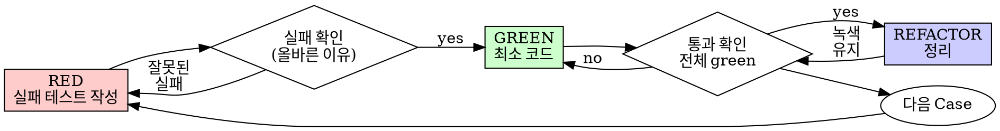

# Test-Driven Development (TDD)

## Overview

테스트를 먼저 쓰고, 실패를 확인하고, 최소 코드로 통과시킵니다.

**Core principle:** 테스트가 **실제로 실패하는 것을 눈으로 보지 않았다면**, 그 테스트가
올바른 것을 검증하는지 알 수 없습니다.

**규칙의 자구를 어기는 것은 규칙의 정신을 어기는 것입니다.**

---

## Input Source: Design Document

이 스킬은 `designing` 스킬이 산출한 설계 문서를 **진실의 원천**으로 사용합니다.
시작할 때 `docs/design/YYYY-MM-DD-<주제>.md`가 이미 존재합니다. 그 문서의 각 Unit은
이미 **Test Cases 목록**을 갖고 있습니다.

### Mandatory Rules

1. **설계 문서의 Test Case를 누락하지 말 것.** 모든 Case가 코드 테스트가 되어야 합니다.
2. **설계 문서에 없는 테스트를 추가하지 말 것.** 추가가 필요하면 TDD를 멈추고
   설계 문서를 먼저 업데이트한 뒤 돌아옵니다.
3. **동일 Unit 안에서는 정의된 순서대로** Case를 구현합니다.

### Unit 처리 순서

설계 문서의 **Dependencies를 따라 leaf부터** 구현합니다. 의존성이 없는 Unit 먼저,
그 Unit에 의존하는 Unit 나중. 이러면 mock 없이 진짜 구현을 조합해 테스트할 수 있습니다.

---

## When to Use

**항상:**
- 새 기능
- 버그 수정
- 리팩터링
- 동작 변경

**예외 (사용자에게 먼저 확인):**
- 한 번 쓰고 버릴 프로토타입
- 생성된 코드
- 설정 파일

"이번 한 번만 TDD를 건너뛸까"라는 생각? **멈추세요.** 그건 합리화입니다.

---

## The Iron Law

```
NO PRODUCTION CODE WITHOUT A FAILING TEST FIRST
```

테스트보다 먼저 코드를 작성했다면? **삭제하고 다시 시작합니다.**

**예외 없음:**
- "참고용으로 남겨두자" — 안 됨
- "테스트 쓰면서 맞춰 고치자" — 안 됨
- "보기만 하고 따라 쓰자" — 안 됨
- **삭제는 삭제.**

테스트로부터 새로 구현합니다. 끝.

---

## Red-Green-Refactor



### RED — 실패 테스트 작성

설계 문서의 Test Case **하나**를 실제 테스트 코드로 변환합니다.

<Good>
```typescript
// RED: NotificationChecker.check의 첫 번째 Case
// 설계 문서의 "happy path — 마감 지남 + 미알림" 케이스
test('returns notify action for overdue untouched todo', () => {
  const todos = [{ id: 1, due: new Date('2025-01-01'), notifiedAt: null }];
  const now = new Date('2025-01-02');

  const result = check(todos, now);

  expect(result).toEqual([{ type: 'notify', todoId: 1 }]);
});
```
명확한 이름, 실제 동작 테스트, 한 번에 한 가지
</Good>

<Bad>
```typescript
test('check works', () => {
  const mock = jest.fn().mockReturnValue([{ type: 'notify' }]);
  mock([]);
  expect(mock).toHaveBeenCalled();
});
```
애매한 이름, mock이 자기 자신을 검증
</Bad>

**요건:**
- **한 가지 동작만** — 한 Case = 한 test()
- **명확한 이름** — 동작을 서술
- **실제 코드** — mock은 불가피할 때만

### Verify RED — 실패 확인

**필수. 건너뛰지 않습니다.**

```bash
npm test path/to/test.test.ts
```

확인:
- 테스트가 **FAIL** 한다 (error가 아니라)
- 실패 메시지가 **예상한 것**이다
- "기능이 없어서" 실패한다 (오타 때문이 아니라)

**테스트가 통과한다?** 이미 존재하는 동작을 테스트하고 있는 것. 테스트를 고치세요.

**테스트가 error?** 문법/import 에러. 고치고 다시 실행해서 **FAIL**이 나오게 합니다.

### GREEN — 최소 코드

테스트를 통과시키는 **가장 단순한 코드**를 씁니다.

<Good>
```typescript
function check(todos: Todo[], now: Date): NotifyAction[] {
  return todos
    .filter(t => t.due < now && t.notifiedAt === null)
    .map(t => ({ type: 'notify' as const, todoId: t.id }));
}
```
테스트를 통과시킬 딱 그만큼
</Good>

<Bad>
```typescript
function check(
  todos: Todo[],
  now: Date,
  options?: {
    dedupeWindow?: number;
    priorityOrder?: 'asc' | 'desc';
    onSkip?: (todo: Todo) => void;
  }
): NotifyAction[] {
  // YAGNI 대참사
}
```
설계에 없는 옵션 추가
</Bad>

**금지:**
- 현재 테스트를 넘어서는 기능 추가
- 관련 없는 코드 "개선"
- 설계에 없는 옵션/파라미터 추가

### Verify GREEN — 통과 확인

**필수.**

```bash
npm test path/to/test.test.ts
```

확인:
- 테스트 **통과**
- 기존 테스트 **깨짐 없음**
- 출력 **깨끗** (warning/error 없음)

**실패?** 테스트가 아니라 **코드**를 고치세요.

**다른 테스트 실패?** 지금 고칩니다.

### REFACTOR — 정리

녹색이 된 후에만:
- 중복 제거
- 이름 개선
- 헬퍼 추출

**동작은 변경 금지. 모든 테스트 녹색 유지.**

### Repeat

다음 Test Case → RED로 다시.

---

## Good Tests

| 특성 | Good | Bad |
|---|---|---|
| **최소성** | 한 가지. 이름에 "and"? 쪼개기. | `test('validates email and domain and whitespace')` |
| **명확성** | 이름이 동작을 서술 | `test('test1')` |
| **의도 표현** | 의도된 API를 드러냄 | 코드가 뭘 해야 하는지 가림 |

---

## 순서가 중요한 이유

**"코드 먼저 쓰고 테스트로 확인할게"**

코드 뒤에 쓴 테스트는 **즉시 통과**합니다. 즉시 통과는 **아무것도 증명하지 못합니다**:
- 엉뚱한 것을 테스트할 수 있음
- 동작이 아니라 구현을 테스트할 수 있음
- 놓친 엣지 케이스를 여전히 놓침
- 테스트가 실제로 작동하는 것을 본 적이 없음

테스트를 먼저 쓰면 **실패를 눈으로 보게 되고**, 그게 테스트가 진짜 뭔가를 검증한다는 증거입니다.

**"수동으로 다 테스트해봤는데"**

수동 테스트는 임시적입니다:
- 뭘 테스트했는지 기록이 없음
- 코드 바뀌면 다시 돌릴 수 없음
- 압박 상황에서 까먹기 쉬움
- "해봤을 때 됐어" ≠ 포괄적

자동화 테스트는 체계적입니다. 매번 같은 방식으로 실행됩니다.

**"X 시간 작업한 걸 삭제하는 건 낭비"**

매몰 비용 오류. 그 시간은 이미 사라졌습니다. 지금 당신의 선택은:
- 삭제하고 TDD로 다시 쓰기 (X 시간 + 높은 신뢰도)
- 유지하고 뒤에 테스트 붙이기 (30분 + 낮은 신뢰도 + 버그 잠복 가능성)

**"낭비"는 신뢰할 수 없는 코드를 유지하는 것입니다.**

**"TDD는 교조적이다. 실용적이란 건 상황에 맞추는 것"**

TDD**야말로** 실용적입니다:
- 커밋 전에 버그 발견 (나중에 디버깅보다 빠름)
- 회귀 방지 (테스트가 깨짐을 즉시 잡음)
- 동작 문서화 (테스트가 사용법을 보여줌)
- 리팩터 가능 (자유롭게 바꿔도 테스트가 잡아냄)

"실용적" 지름길 = 프로덕션에서 디버깅 = 더 느림.

---

## Common Rationalizations

| 변명 | 현실 |
|---|---|
| "너무 단순해서 테스트 필요 없어" | 단순한 코드도 깨집니다. 테스트 30초. |
| "뒤에 테스트 쓸게" | 즉시 통과는 아무것도 증명 못 함. |
| "이미 수동 테스트 끝냄" | 임시적 ≠ 체계적. 기록 없고, 재실행 불가. |
| "삭제하는 건 낭비" | 매몰비용 오류. 검증 안 된 코드 유지가 기술부채. |
| "참고용으로 남길게" | 결국 그걸 보고 쓰게 됨. **삭제 = 삭제**. |
| "탐색이 먼저 필요해" | 좋아요. 탐색 결과 **버리고** TDD로 시작. |
| "테스트 어려움 = 설계 불명확" | 테스트의 말을 들으세요. 테스트 어려움 = 사용도 어려움. |
| "TDD가 느려" | 디버깅보다 빠름. 실용적 = 테스트 먼저. |
| "기존 코드엔 테스트가 없어" | 당신이 개선합니다. 기존 코드에도 테스트 추가. |

---

## Red Flags — STOP, 다시 시작

- 테스트 전에 코드
- 구현 뒤에 테스트
- 테스트가 즉시 통과
- 테스트가 왜 실패했는지 설명 못 함
- "나중에" 테스트 추가
- "이번 한 번만" 합리화
- "이미 수동 테스트했어"
- "테스트 뒤에 써도 같은 목적 달성"
- "자구가 아니라 정신이 중요"
- "참고용으로 남길게" 또는 "기존 코드 맞춰 쓰기"
- "이미 X시간 썼는데 지우는 건 낭비"
- "TDD는 교조적, 나는 실용적"
- "이 경우는 달라서..."

**이 전부의 의미: 코드 삭제, TDD로 다시 시작.**

---

## Example: Bug Fix

**Bug:** 빈 이메일이 통과됨

**RED**
```typescript
test('rejects empty email', async () => {
  const result = await submitForm({ email: '' });
  expect(result.error).toBe('Email required');
});
```

**Verify RED**
```
FAIL: expected 'Email required', got undefined
```

**GREEN**
```typescript
function submitForm(data: FormData) {
  if (!data.email?.trim()) {
    return { error: 'Email required' };
  }
  // ...
}
```

**Verify GREEN**
```
PASS
```

**REFACTOR**
여러 필드 검증이 필요하면 validation 헬퍼로 추출.

---

## Commit Convention

커밋 메시지에 **설계 문서의 Unit 이름**을 반드시 참조합니다. 리뷰어가 추적할 때 사용합니다.

```
feat(notifications): NotificationChecker.check 구현

- Unit: NotificationChecker.check (from docs/design/2026-04-16-notifications.md)
- Cases covered: happy path, already notified, empty input, future due
```

**커밋 단위:**
- Unit이 작으면 **Unit 단위** 커밋 (Case 여러 개 한 번에)
- Unit이 크면 **Case 단위** 커밋

**커밋 타이밍:** GREEN 직후 또는 REFACTOR 후. RED 상태로 커밋 금지.

---

## Verification Checklist

작업 완료 마크 전에:

- [ ] 설계 문서의 모든 Unit이 구현됐다
- [ ] 설계 문서의 모든 Test Case가 실제 test()로 존재한다
- [ ] 각 test()가 실제로 실패하는 것을 본 적이 있다 (RED 확인)
- [ ] 각 실패가 예상된 이유로 실패했다 (기능 없음, 오타 아님)
- [ ] 각 테스트를 통과시킨 코드는 최소한이다
- [ ] 모든 테스트 통과
- [ ] 출력 깨끗 (warning/error 없음)
- [ ] 테스트가 실제 코드를 사용한다 (mock은 불가피할 때만)
- [ ] 설계에 없는 추가 테스트가 없다 (있다면 설계 먼저 업데이트했어야 함)

전부 체크 못 함? TDD를 건너뛴 것. 다시 시작.

---

## When Stuck

| 문제 | 해결 |
|---|---|
| 어떻게 테스트할지 모름 | 바라는 API를 먼저 써보기. assertion부터 쓰기. 사용자에게 묻기. |
| 테스트가 너무 복잡 | 설계가 복잡. 인터페이스 단순화 → 설계로 돌아가기. |
| 전부 mock해야 함 | 결합도 과다. DI로 리팩터 → 설계로 돌아가기. |
| setup이 거대함 | 헬퍼 추출. 그래도 복잡하면 설계 단순화. |

**"설계로 돌아가기"는 `designing` 스킬을 다시 호출하는 것이 아니라, 설계 문서를
수동으로 업데이트하고 TDD를 이어가는 것입니다. 큰 변경이면 사용자에게 승인 요청.**

---

## Debugging Integration

버그 발견시:
1. 버그를 **재현하는 실패 테스트**를 먼저 쓴다
2. TDD 사이클을 따라 수정한다
3. 테스트가 수정을 증명하고 회귀를 방지한다

테스트 없이 버그 수정 금지.

시스템이 왜 깨졌는지 근본 원인이 불명확하면 `systematic-debugging` 스킬을 먼저 호출합니다.

---

## Testing Anti-Patterns

mock이나 테스트 유틸을 추가할 때는 @testing-anti-patterns.md 를 읽고 흔한 함정을 피합니다:
- 실제 동작이 아닌 mock 동작 테스트
- 프로덕션 클래스에 테스트 전용 메서드 추가
- 의존성 이해 없이 mock

---

## Final Rule

```
프로덕션 코드 → 먼저 실패한 테스트가 존재
그렇지 않음 → TDD 아님
```

사용자의 명시적 허락 없이 예외 없음.
