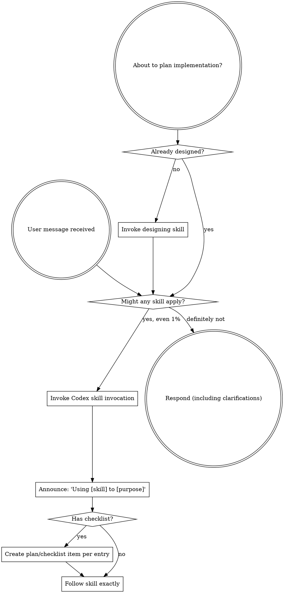

<SUBAGENT-STOP>
If you were dispatched as a subagent to execute a specific task, skip this skill.
</SUBAGENT-STOP>

<EXTREMELY-IMPORTANT>
If you think there is even a 1% chance a skill might apply to what you are doing, you ABSOLUTELY MUST invoke the skill.

IF A SKILL APPLIES TO YOUR TASK, YOU DO NOT HAVE A CHOICE. YOU MUST USE IT.

This is not negotiable. This is not optional. You cannot rationalize your way out of this.
</EXTREMELY-IMPORTANT>

## Instruction Priority

이 플러그인의 스킬들은 기본 시스템 프롬프트 동작을 덮어쓰지만, **사용자 명시 지시가 항상 최우선**입니다:

1. **사용자 명시 지시** (AGENTS.md, 직접 요청) — 최우선
2. **이 플러그인의 스킬** — 기본 시스템 동작을 덮어씀
3. **기본 시스템 프롬프트** — 최저

사용자가 AGENTS.md에 "TDD 쓰지 마"라고 적었고 스킬은 "항상 TDD"라고 말한다면, **사용자 지시를 따릅니다**. 사용자가 통제권을 가집니다.

## How to Access Skills

**Codex:** Skills are available through implicit matching by `description` and explicit invocation such as `$designing` or `/skills`. When a skill applies, invoke it before taking action. Do not manually read `SKILL.md` as a substitute for invoking the skill unless Codex has no skill invocation UI available in the current environment.

# 이 플러그인의 핵심 워크플로우

**3단계 파이프라인:** 설계 → 코딩 → 리뷰

```
사용자 요청
   │
   ▼
┌──────────────────────────────────────────────────────┐
│ designing                                             │
│ - 목적/제약/성공기준 질문 (한 번에 하나)              │
│ - 2~3개 접근법 제시 + 추천                            │
│ - 아키텍처 섹션별 승인                                │
│ - TDD-ready 슈도코드 산출                             │
│ - docs/design/YYYY-MM-DD-<주제>.md 저장              │
│ - 사용자 최종 승인                                    │
└──────────────────────────────────────────────────────┘
   │ (terminal state)
   ▼
┌──────────────────────────────────────────────────────┐
│ test-driven-development                               │
│ - 설계 문서의 Unit을 Dependencies 순서로 순회         │
│ - 각 Test Case마다 엄격 RED-GREEN-REFACTOR           │
│ - Case/Unit 단위 커밋 (설계 문서 참조 메시지)         │
└──────────────────────────────────────────────────────┘
   │ (피처 완성)
   ▼
┌──────────────────────────────────────────────────────┐
│ requesting-code-review                                │
│ Stage 1: Spec Compliance (서브에이전트)               │
│ Stage 2: Code Quality (서브에이전트)                  │
│ - 이슈 있음 → receiving-code-review 호출              │
└──────────────────────────────────────────────────────┘
```

# 이 플러그인의 스킬 목록

## Process Skills (HOW to approach a task)

- **designing** — 아이디어 → 설계 → TDD-ready 슈도코드 (Socratic dialogue)
- **test-driven-development** — 엄격 RED-GREEN-REFACTOR 사이클
- **requesting-code-review** — 2단계 리뷰 (spec compliance → code quality)
- **receiving-code-review** — 리뷰 피드백에 대한 반응 방법

## Utility Skills

- **systematic-debugging** — 버그의 근본 원인 추적 (4단계 프로세스)

# Using Skills

## The Rule

**관련되거나 요청된 스킬은 어떤 응답/액션보다 먼저 호출합니다.** 1%라도 관련 있을 가능성이 있으면 스킬을 호출합니다. 호출 후 맞지 않으면 그때 버리면 됩니다.



## Red Flags — 합리화 감지

이런 생각이 들면 **멈추세요** — 합리화 중입니다:

| 생각 | 현실 |
|------|------|
| "그냥 간단한 질문인데" | 질문도 작업. 스킬을 체크하세요. |
| "먼저 컨텍스트가 좀 더 필요해" | 스킬 체크가 명확화 질문보다 먼저. |
| "코드베이스부터 좀 보자" | 스킬이 **어떻게** 탐색할지 알려줍니다. 먼저 체크. |
| "git/파일 빨리 보고 올게" | 파일은 대화 컨텍스트가 없음. 스킬 체크 먼저. |
| "이건 정식 스킬 쓸 정도는 아님" | 스킬이 있으면 씁니다. |
| "스킬 내용 기억하는데" | 스킬은 진화합니다. 현재 버전을 읽으세요. |
| "이건 작업이 아닌데" | 액션 = 작업. 스킬 체크. |
| "스킬은 과함" | 단순한 게 복잡해집니다. 씁니다. |
| "이거 하나만 먼저 하고" | 뭘 하기 **전에** 체크. |
| "생산적으로 느껴져" | 규율 없는 행동은 시간 낭비. 스킬이 방지. |
| "그 개념 알아요" | 개념을 아는 것 ≠ 스킬을 쓰는 것. 호출하세요. |

## Skill Priority

여러 스킬이 해당될 수 있을 때의 순서:

1. **Process skills 먼저** (designing, systematic-debugging) — **어떻게** 접근할지 결정
2. **그 다음 execution/utility** — 구체적 실행

- "X 만들자" → `designing` 먼저, 그 결과에서 `test-driven-development`
- "이 버그 고쳐" → `systematic-debugging` (근본 원인) → `designing` (수정 설계) → TDD

## User Instructions

사용자 지시는 **무엇**을 말하지 **어떻게**를 말하지 않습니다. "X 추가해"나 "Y 고쳐"가 워크플로우를 건너뛰라는 뜻은 아닙니다.
